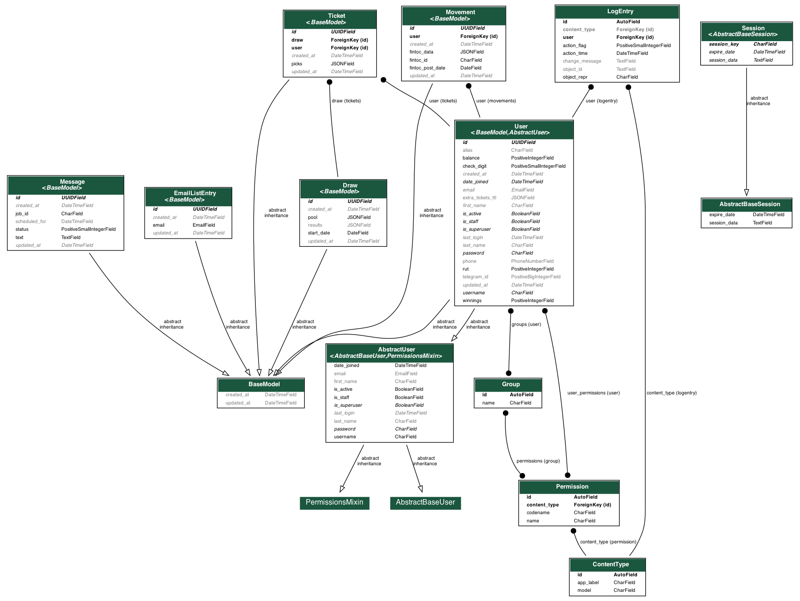

# ConYappa MVP

> The backend application of YappaBot, version 0.9.0



## Servers

[](https://conyappa.cl)

[](https://staging.conyappa.cl)

## Requirements

- [Docker](https://www.docker.com/) (needed)
- [Docker Compose](https://docs.docker.com/compose/) (needed)
- [Make](https://en.wikipedia.org/wiki/Make_(software)) (highly recommended)
- [Poetry](https://python-poetry.org/docs/) (highly recommended)

## Install for local development

Create your local settings (_i.e._, environment variables)

```bash
make setlocalenv
```

Build the images

```bash
docker-compose build --parallel
```

Optional: drop the database

```bash
docker-compose down --volumes
```

Run the migrations

(Tip: the database might not be ready yet; if it fails then try again)

```bash
make migrate
```

Run the application

```bash
docker-compose up
```

Stop the apps (on another terminal)

```bash
docker-compose down
```

## Write some code

Create a development-friendly virtual environment

```bash
make createvenv
```

Un-ignore new files at the `.dockerignore` as needed.
